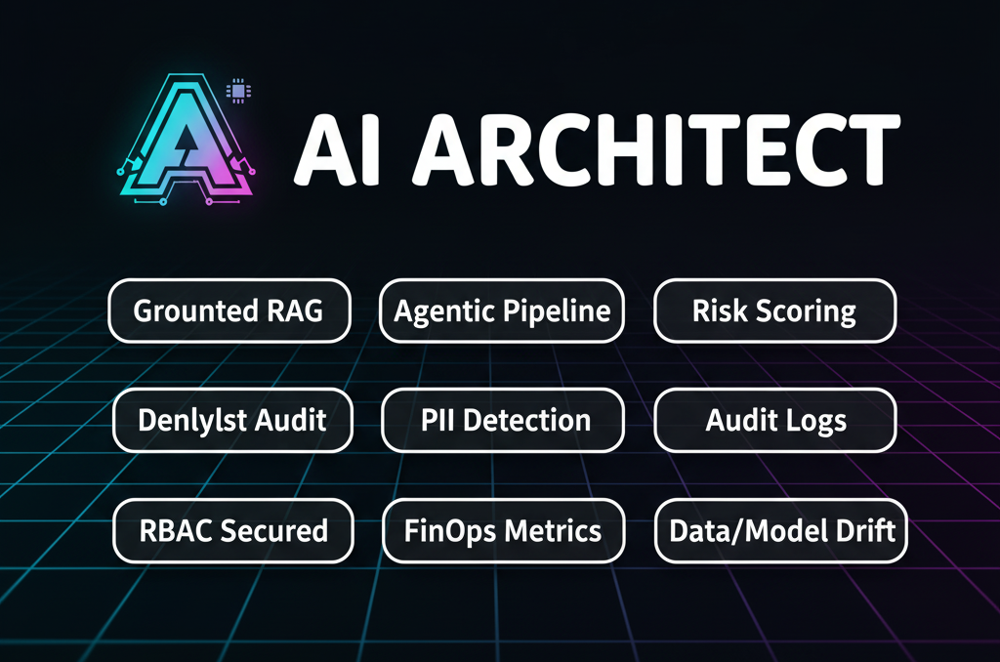
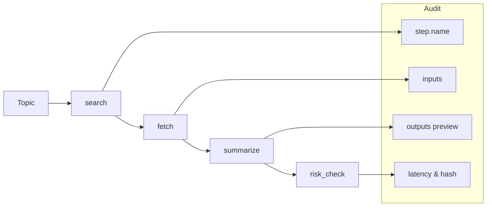

# AI Architect

> Architect-first OSS experience for designing and operating safe, observable, and cost-aware AI.
> Primary experience: Architect agent with dynamic grounding, structured plans, and progressive streaming.

---



## What is AI Architect

AI Architect is a lightweight, open-source reference architecture for designing and operating safe, observable, and cost-aware AI systems. It blends a hands-on learning experience with a production-minded blueprint.

Community-driven vision
- Learn: explore real code and best practices for AI architecture end-to-end.
- Architect: interact with the Architect agent to get guidance, brainstorm approaches, and map ideas to implementation steps.
- Evolve: as you chat, the agent may propose feature ideas that align with the project’s vision; contribute by opening issues and PRs.

> Careful with the Architect agent—it has a habit of turning brainstorms into to-do lists.

Highlights
- Grounded Q&A with citations (deterministic by default in tests)
- Agentic pipelines with tool auditing and request-level audit rows
- ML lifecycle examples with MLflow + drift checks
- FinOps metrics (tokens, cost) exposed at /metrics

For deeper topics (API, RAG, memory, security, MLOps), see docs/README.md.

---

## Quickstart

```
Client → FastAPI Gateway
         ├── /query     (LLM + optional RAG) ─┐
         ├── /research  (Agent pipeline)      ├─→ Audit DB (SQLite/Postgres)
         ├── /predict   (MLflow model)        ┘
         ├── /metrics   (Prometheus text)
         └── /healthz
    [Structured logs + Request IDs + Token/Cost tracker + RBAC stub]
```

Architecture (Mermaid)




---

## Quickstart

```bash
# 0) Clone & env
git clone https://github.com/<you>/ai-risk-monitor
cd ai-risk-monitor
cp .env.example .env  # fill in keys if using a hosted LLM (or start with local/stub embeddings)

# 1) Setup venv and install
python3 -m venv .venv
. .venv/bin/activate
pip install -e .

# 2) (Optional) Ingest docs for RAG (LangChain mode)
# Place .md/.txt/.pdf files under DOCS_PATH; sample: examples/gdpr.txt and examples/gdpr.pdf
python scripts/ingest_docs.py

# 3) Run locally
uvicorn app.main:app --host 0.0.0.0 --port 8000

# 4) Smoke test
curl -X POST localhost:8000/query \
  -H "Content-Type: application/json" \
  -H "X-User-Role: analyst" \
  -d '{"question":"What is GDPR?", "grounded": true}'

# Guest (no role header) can use ungrounded query
curl -X POST localhost:8000/query \
  -H "Content-Type: application/json" \
  -d '{"question":"What is GDPR?", "grounded": false}'

# 5) Metrics
curl localhost:8000/metrics | sed -n '1,80p'
```

### Architect UI

- Unified UI at http://localhost:8000/ui (Architect-first).

### Architect mode

- Dynamic grounding; no explicit mode required.
- For the Project Guide feature set and behavior, see docs/project_guide_rag.md.
- UI: open http://localhost:8000/ui

## Learn more

See docs/README.md for the full documentation index. Useful deep links:
- docs/api.md — endpoints and schemas
- docs/rag.md — retrieval config and ingestion
- docs/rag_vector_backends.md — vector backends roadmap
- docs/architecture_index.md — system overview and file map
- docs/observability.md — metrics and dashboards
- docs/security.md — RBAC, PII, retention
- docs/mlops_plan.md — ML lifecycle plan
- docs/getting_started.md — this quickstart in more detail

---

<!-- Details moved to docs/api.md; keep README high-level. -->

## Screenshots

* `POST /query`
  Input: `{ question: str, grounded?: bool }`
  Output: `{ answer, citations[], request_id, tokens, cost_usd }`

* `POST /research`
  Input: `{ topic: str, steps?: ["search","fetch","summarize","risk_check"] }`
  Output: `{ findings[], sources[], steps[], audit }`

  Example:
  ```bash
  curl -X POST localhost:8000/research -H "Content-Type: application/json" \
    -d '{
      "topic": "Latest updates on GDPR and AI",
      "steps": ["search","fetch","summarize","risk_check"]
    }'
  ```

  Notes:
  - Deterministic, offline-friendly by default (AGENT_LIVE_MODE=false).
  - Step-level audit is included (name, inputs, outputs preview, latency, hash, timestamp).
  - Denylist terms flagged into audit.compliance_flag.
  - To enable live fetch, set `AGENT_LIVE_MODE=true` and optionally `AGENT_URL_ALLOWLIST` (comma-separated prefixes).

* `POST /predict`
  Input: `{ features: {...} }`
  Output: `{ prediction, model_version, request_id }`

  Example:
  ```bash
  # Train a tiny model (local MLflow)
  . .venv/bin/activate && python ml/train.py

  # Predict using latest run artifact
  curl -X POST localhost:8000/predict -H "Content-Type: application/json" \
    -d '{"features": {"f0": 0.1, "f1": -0.2, "f2": 0.3, "f3": 0.0, "f4": 0.2, "f5": -0.1, "f6": 0.0, "f7": 0.0}}'
  ```

* `POST /risk`
  Input: `{ text: str }`
  Output: `{ label, value, rationale, audit }`
  Notes:
  - Heuristic scorer by default. Enable ML-like scoring with `RISK_ML_ENABLED=true` and optionally set `RISK_THRESHOLD` (default 0.6).

* `GET /metrics` → Prometheus text (latency, tokens, cost, requests)

* `GET /memory/short` — list short-term memory for a session (analyst/admin)
* `DELETE /memory/short` — clear short-term memory for a session (analyst/admin)
* `GET /memory/long` — list long-term facts (analyst/admin)
* `DELETE /memory/long` — clear long-term facts (analyst/admin)
* `GET /memory/long/export` — export long-term facts (analyst/admin)
* `POST /memory/long/import` — import long-term facts (analyst/admin)
* `GET /memory/status` — admin-only status and config overview

---

<!-- Deep details moved to docs/observability.md and docs/security.md. -->

## Observability and security (at a glance)

* **Structured JSON logs** with `request_id` (propagated)
* **Audit DB row** per request: timestamps, role, prompt/resp hashes, flags
* **Token & cost** estimator (per model) aggregated by user/day
* **Denylist** (e.g., “SSN”, “PHI”) → `compliance_flag=true` in audit row
* **Retention** via `LOG_RETENTION_DAYS` (cron or on-demand sweep)

### Retention Sweeper
- Deletes audit rows older than `LOG_RETENTION_DAYS` (default: 30).
- Run it via VS Code task: “Sweep retention (audit)”, or CLI:
  - `. .venv/bin/activate && python scripts/sweep_retention.py`

---

<!-- ML details moved to docs/ml.md and docs/mlops_plan.md. -->

## ML lifecycle (at a glance)

* `ml/train.py` trains a tiny model (e.g., churn) → logs params/metrics/artifacts
* Register best model → served by `/predict` via `mlflow_client.py`
* `ml/drift.py` runs **PSI/KS** drift check; if over threshold, writes a “retrain recommended” flag (and exits non-zero in CI if you want to gate promotion)

---

<!-- Agent details moved to docs/agents.md. -->

## Agentic pipeline (at a glance)

* Deterministic steps: `search → fetch → summarize → risk_check`
* **Tool calls audited** (name, args, latency, result hash)
* Safety hook blocks disallowed tools (documented in README)

### Agent Flow (Mermaid)


---

## Security and governance (at a glance)

### PII configuration
- Environment variables:
  - PII_TYPES: comma-separated base types to detect (default: email,phone,ssn,credit_card,ipv4). Additional types available: ipv6, iban, passport.
  - PII_LOCALES: comma-separated locales to enable locale-specific patterns (e.g., US,UK,CA,DE).
- Example:
  - export PII_TYPES="email,phone,ssn,credit_card,ipv4"
  - export PII_LOCALES="US,UK,CA"
- Try it:
  - curl -X POST localhost:8000/pii -H "Content-Type: application/json" -H "X-User-Role: analyst" -d '{"text":"Contact bob@example.com, UK NI AB123456C, ZIP 12345-6789"}'
- Notes:
  - Some locale patterns are simplified for demonstration and may produce false positives.
  - Masking reveals only head/tail of detected values; use PII endpoint for previews and audit aggregation.

* **No secrets** in code; use `.env.example`
* **RBAC**: roles (`admin`, `analyst`, `guest`) enforced via `X-User-Role` header
  - /metrics: open by default. To protect, set METRICS_TOKEN and have your scraper send header `X-Metrics-Token: $METRICS_TOKEN`.
  - /predict: analyst/admin
  - /query: grounded=true requires analyst/admin; guest allowed grounded=false
  - /research: guest cannot use `fetch` step; analyst/admin allowed
* **Data Card & Model Card** in `docs/` (templated Markdown)
* **Prompt Registry** in `prompts/*.yaml` (versioned, code-reviewed). Load via `app.utils.prompts.load_prompt(name, version)`.

---

## Retrieval backend notes

- Retrieval now uses the LangChain-backed path by default (legacy path removed). This resolves intermittent citation issues and simplifies configuration.
- Multi-query and hyDE improvements are planned on top of the LC path.

## Local development and testing

### Pre-commit hooks
- Install and enable:
  - pip install pre-commit
  - pre-commit install
- Run manually:
  - pre-commit run --all-files

### System dependencies
- jq is required for the E2E script (scripts/manual_e2e_test.sh) to pretty-print and validate JSON.
  - Ubuntu/Debian: `sudo apt-get update && sudo apt-get install -y jq`
  - macOS (Homebrew): `brew install jq`
  - Fedora: `sudo dnf install -y jq`

See docs/testing.md for a full cheat sheet. You can also use the Makefile for convenience.

```bash
# Create venv and install
make venv

# Run tests
make test

# Start API
make serve

# Export OpenAPI (when endpoints/schemas change)
make export-openapi
```

Manual commands (if you prefer):

```bash
python -m venv .venv
. .venv/bin/activate
pip install -e .
.venv/bin/python -m pytest -q
uvicorn app.main:app --reload
```

---

## CI/CD (GitHub Actions)

* **ci.yml** runs on PR & main:

  * Setup Python, install deps
  * Ruff + mypy + pytest
  * `python ml/train.py` with small data (fast) — logs params/metrics/artifacts to MLflow local path
  * `python ml/drift.py --baseline ml/data/baseline.csv --input ml/data/new_batch.csv` (deterministic drift check)
    - Non-fatal by default in CI via `|| true`; remove `|| true` to fail the build on drift > threshold
  * Optionally push “candidate model” tag if metrics ≥ baseline
* (Optional) CD: deploy container to Render/Fly.io/Cloud Run (later)

### Local Observability Stack (Prometheus + Grafana)
- Start everything:
  ```bash
  docker compose up --build
  ```
- Prometheus: http://localhost:9090 (scraping /metrics)
- Grafana: http://localhost:3000 (admin/admin by default)
  - Datasource and dashboard are auto-provisioned (Prometheus at http://prometheus:9090).
  - If you set METRICS_TOKEN, update Prometheus to send the header:
    
    scrape_configs:
      - job_name: 'ai-monitor'
        static_configs:
          - targets: ['api:8000']
        metrics_path: /metrics
        scheme: http
        headers:
          X-Metrics-Token: ${METRICS_TOKEN}

  - If needed, import dashboard: docs/grafana/ai-monitor-dashboard.json

### CPU-only builds (PyTorch)
- The Docker images pre-install CPU-only PyTorch wheels to avoid slow CUDA downloads.
- This is done via:
  - pip install --index-url https://download.pytorch.org/whl/cpu torch torchvision torchaudio
- If you need GPU builds, remove that line and install the default CUDA-enabled wheels (or set the appropriate CUDA index URL) before installing project deps.
- For reproducibility, you may pin versions, for example:
  - torch==2.4.1 torchvision==0.19.1 torchaudio==2.4.1 with the CPU index URL.

### Deploy on Render (Docker)
1. Push this repo to GitHub.
2. In Render, create a new Web Service and connect the repo.
3. Choose “Deploy from Docker” and keep Dockerfile at repo root.
4. Set environment variables (from `.env.example`), at minimum:
   - APP_ENV=production
   - LOG_LEVEL=INFO
   - EMBEDDINGS_PROVIDER=stub (or local/openai)
   - VECTORSTORE_PATH=/data/vectorstore (if you add a disk)
   - DOCS_PATH=/app/examples
   - DB_URL=sqlite:////data/audit.db (if you add a disk)
5. Health check path: `/healthz` (port 8000).
6. (Optional) Add a persistent disk and mount at `/data` for audit.db and vectorstore.
7. Click Deploy. The app should be reachable at your Render URL.

---

## Demo script (90 seconds)

1. `uvicorn app.main:app` → hit `/healthz`
2. `POST /query` with grounded=true → show citations + cost
3. `GET /metrics` → point out latency, tokens, cost
4. Open `audit` table → show request row (hashes, flags, role)
5. (Later) Run `python ml/drift.py` → show drift flag → (optional) retrain action

### Screenshots (what to capture)
- CI: GitHub Actions run for main showing green checks
- Logs: Run API and capture JSON logs
  - `. .venv/bin/activate && uvicorn app.main:app --host 0.0.0.0 --port 8000 | tee logs/app.log`
  - Open `logs/app.log` for a compact JSON log screenshot
- Metrics: `curl localhost:8000/metrics` and capture counters/histograms
- MLflow UI: launch with `mlflow ui --backend-store-uri ./.mlruns` then open http://127.0.0.1:5000 and capture

---

## Known limitations

* Local vector store (Chroma/FAISS); swap for managed in prod
* Cost estimator approximates vendor pricing; not real billing
* RBAC is illustrative only; integrate with real IdP in prod
* Agent uses public sources; add Evals before production use

---

## Roadmap

### Phase 0 — Bootstrap

- [x] FastAPI app skeleton + /healthz
- [x] JSON logger with request_id
- [x] SQLite DB + audit table (persist audit rows)
- [x] /query using a stub LLM (no external calls)
- [x] Token/cost estimator (mock) + /metrics
- [x] Basic tests (routers + audit write)
- [x] CI: ruff + pytest

### Phase 1 — Core Value

- [x] RAG: ingest local docs with Chroma (scripts/ingest_docs.py)
- [x] /query returns citations when grounded=true
- [x] Denylist check + compliance_flag (env-based)
- [x] Retention sweeper (delete audit rows older than LOG_RETENTION_DAYS)
- [x] README architecture diagram + screenshots

### Phase 2 — Agent & MLflow

- [x] /research: search → fetch → summarize → risk_check
- [x] Agent step audit (tool name, args, latency, hash)
- [x] ML: ml/train.py → MLflow (local) logs params/metrics/artifacts
- [x] /predict loads latest model from MLflow local store
- [x] ml/drift.py (PSI) + “retrain recommended” flag
- [x] CI runs tiny train.py and drift.py on PR

### Phase 3 — Polish

- [x] Role-based access checks (admin/analyst/guest)
- [x] Prompt registry (prompts/*.yaml) + loader
- [x] Grafana dashboard (pre-provisioned via docker-compose)
- [x] Dockerized one-click deploy (Render)
- [x] Data Card & Model Card in docs/

### Phase 4 — RAG + Router

- [x] LangChain RetrievalQA (LC-only) for grounded QA
- [x] Simple Router Agent (feature-flagged) selects intent (qa, pii_detect, risk_score, other)
- [x] Audit enrichment: rag_backend, router_backend, router_intent; structured log event
- [x] Tests and docs updated (flags, API fields, agents overview)
- [x] Extend router rules/config and add richer backends (rules backend v2 with JSON-config)
- [ ] Router Agent UI/docs examples (optional)


### Phase 5 — PII Detection

- [x] Regex-based PII detection agent (email, phone, SSN, IPv4, credit_card + Luhn)
- [x] Extended patterns (IPv6, IBAN, passport)
- [x] /pii endpoint with masked previews; configurable PII_TYPES
- [x] Router integration adds pii_* audit fields
- [x] Added locale-aware patterns (US/UK/CA/DE) via PII_LOCALES (simplified)
- [ ] Further pattern extensions/config (additional IDs/locales)

### Phase 6 — Risk Scoring

- [x] Heuristic risk scorer and /risk endpoint
- [x] Router integration adds risk_* audit fields
- [x] Optional ML-like deterministic scorer gated by RISK_ML_ENABLED (flag present; implementation to be enhanced)
- [ ] MLflow-integrated model, registry, and serving with audit fields (see docs/mlops_plan.md)
- [ ] Data drift (PSI) monitoring and reporting (Phase 2)
- [ ] Model drift evaluation (labels/proxies) and gated promotion (Phase 3/4)

### Phase 7 — Memory

- [x] Short-term conversation memory (buffer + rolling summary) per session_id
- [x] Long-term in-process semantic memory (user facts) with retrieval and ingestion
- [x] /query integration: optional session_id, reads/writes, rolling summary after max turns
- [x] Audit enrichment: memory_short_reads/writes, summary_updated, memory_long_reads/writes, memory_short_pruned, memory_long_pruned
- [x] Endpoints to list/clear memory; RBAC and retention policies
- [x] Export/Import long memory; enriched export fields
- [x] Docs and tests for memory and retention

### Phase 8 — Agents & RAG Enhancements

- [x] Policy Navigator Agent (decompose → retrieve → synthesize → recommend)
- [x] PII Remediation Agent (detect → retrieve policy → propose redactions + code snippets)
- [x] Retrieval improvements (multi-query/hyDE)
- [x] Expand docs/testing.md with sequential curl scenarios
- [ ] Extend multi-query/hyDE to LangChain path
- [ ] Router integration for new agents (auto intent)

### Phase 9 — Ops & DX

- [x] Makefile targets (venv, test, serve, lint, export-openapi)
- [x] CONTRIBUTING.md and curl examples
- [ ] OpenAPI export in CI (manual export available via make export-openapi)
- [ ] Deployment recipes, Grafana dashboards packaging
- [ ] Pre-commit hooks and/or VS Code tasks

---

## Tech stack

Note: See docs/README.md for deep dives on API, RAG, agents, and MLOps.

- **API**: FastAPI, Pydantic, Uvicorn
- **Web/UI**: Jinja2 templates, vanilla JS (SSE for streaming)
- **LLM/RAG**: Deterministic retriever (default) or LangChain + Chroma; optional hosted providers via EMBEDDINGS_PROVIDER
- **Agents**: Structured Architect agent; Policy Navigator; PII Remediation; Router (rules-based)
- **ML**: scikit-learn, MLflow (local), drift checks (PSI/KS)
- **Data/DB**: SQLite (local) with SQLAlchemy; optional Postgres
- **Observability**: JSON logs, Prometheus /metrics, Grafana dashboard (provisioned)
- **Testing**: Pytest with deterministic defaults
- **CI**: GitHub Actions (lint, tests, tiny train + drift check)
- **Packaging/Dev**: Makefile targets; Dockerfiles; optional docker-compose for Prometheus/Grafana

---

## Contributing

We grow this reference architecture with the community.
- Start by chatting with the Architect agent. When it proposes a feature aligned with the vision, you can copy its plan into a GitHub issue.
- See CONTRIBUTING.md for guidelines and a quick checklist.
- Docs to consult when shaping proposals: docs/ai-architect-launch.md, docs/rag.md, docs/agents.md, docs/router.md.

Prefer a template? Try the prompts in docs/llm_agent_streaming_prompts.md to generate an issue-ready title/body.

## License

Apache-2.0 (or MIT). Add `LICENSE` file.


