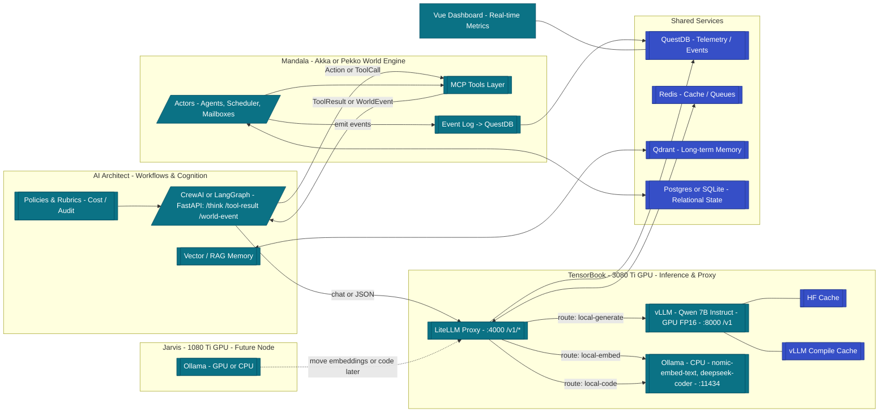
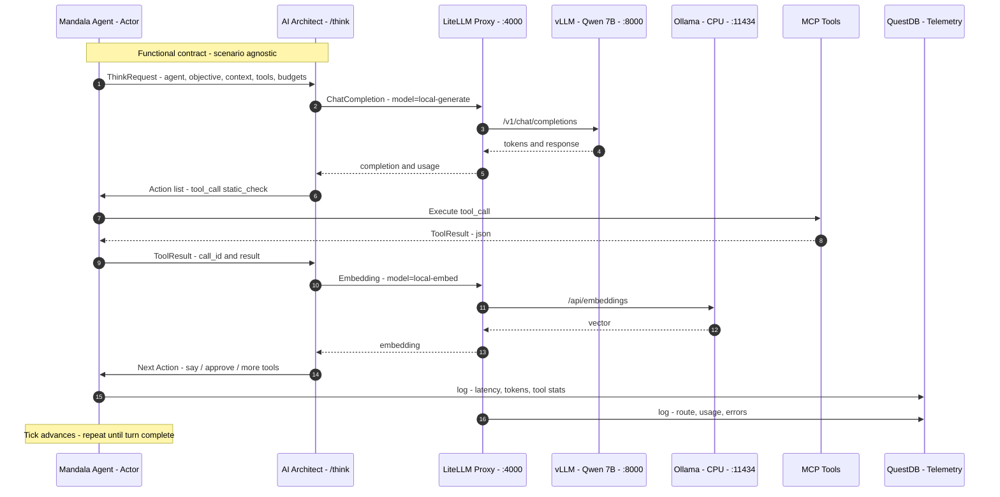

```mermaid

flowchart LR
  %% ========= NODES =========
  subgraph Client["AI Architect - Workflows & Cognition"]
    A1[/CrewAI or LangGraph - FastAPI: /think /tool-result /world-event/]
    A2[[Policies & Rubrics - Cost / Audit]]
    A3[[Vector / RAG Memory]]
  end

  subgraph Proxy["TensorBook - 3080 Ti GPU - Inference & Proxy"]
    L1[[LiteLLM Proxy - :4000 /v1/*]]
    V1[[vLLM - Qwen 7B Instruct - GPU FP16 - :8000 /v1]]
    O1[[Ollama - CPU - nomic-embed-text, deepseek-coder - :11434]]
    C1[[HF Cache]]
    C2[[vLLM Compile Cache]]
  end

  subgraph World["Mandala - Akka or Pekko World Engine"]
    M1[/Actors - Agents, Scheduler, Mailboxes/]
    M2[[MCP Tools Layer]]
    M3[[Event Log -> QuestDB]]
  end

  subgraph Data["Shared Services"]
    Q1[[QuestDB - Telemetry / Events]]
    R1[[Redis - Cache / Queues]]
    VDB[[Qdrant - Long-term Memory]]
    PG[[Postgres or SQLite - Relational State]]
  end

  UI[Vue Dashboard - Real-time Metrics]

  %% ========= LINKS =========
  %% Architect <-> Proxy
  A1 -- chat or JSON --> L1
  L1 -- route: local-generate --> V1
  L1 -- route: local-embed --> O1
  L1 -- route: local-code --> O1

  %% Proxy caches
  V1 --- C1
  V1 --- C2

  %% Architect <-> World
  A1 -- Action or ToolCall --> M2
  M2 -- ToolResult or WorldEvent --> A1
  A2 --> A1
  A3 <--> VDB

  %% World persistence + telemetry
  M1 --> M2
  M1 -- emit events --> M3
  M3 --> Q1
  M1 <--> PG
  L1 --> Q1
  L1 <--> R1

  %% Dashboard
  UI --- Q1

  %% Optional future split
  subgraph Optional["Jarvis - 1080 Ti GPU - Future Node"]
    OJ[[Ollama - GPU or CPU]]
  end
  OJ -. move embeddings or code later .-> L1

  %% Styles
  classDef svc fill:#0b7285,stroke:#064e63,color:#fff
  classDef store fill:#364fc7,stroke:#243a8f,color:#fff
  class A1,A2,A3,L1,V1,O1,M1,M2,M3,UI,OJ svc
  class Q1,R1,VDB,PG,C1,C2 store

```

```mermaid
sequenceDiagram
  autonumber
  participant Mandala as Mandala Agent - Actor
  participant Architect as AI Architect - /think
  participant LiteLLM as LiteLLM Proxy - :4000
  participant vLLM as vLLM - Qwen 7B - :8000
  participant Ollama as Ollama - CPU - :11434
  participant Tools as MCP Tools
  participant QuestDB as QuestDB - Telemetry

  Note over Mandala,Architect: Functional contract - scenario agnostic
  Mandala->>Architect: ThinkRequest - agent, objective, context, tools, budgets
  Architect->>LiteLLM: ChatCompletion - model=local-generate
  LiteLLM->>vLLM: /v1/chat/completions
  vLLM-->>LiteLLM: tokens and response
  LiteLLM-->>Architect: completion and usage
  Architect->>Mandala: Action list - tool_call static_check

  Mandala->>Tools: Execute tool_call
  Tools-->>Mandala: ToolResult - json
  Mandala->>Architect: ToolResult - call_id and result
  Architect->>LiteLLM: Embedding - model=local-embed
  LiteLLM->>Ollama: /api/embeddings
  Ollama-->>LiteLLM: vector
  LiteLLM-->>Architect: embedding

  Architect->>Mandala: Next Action - say / approve / more tools
  Mandala->>QuestDB: log - latency, tokens, tool stats
  LiteLLM->>QuestDB: log - route, usage, errors
  Note over Mandala: Tick advances - repeat until turn complete

```