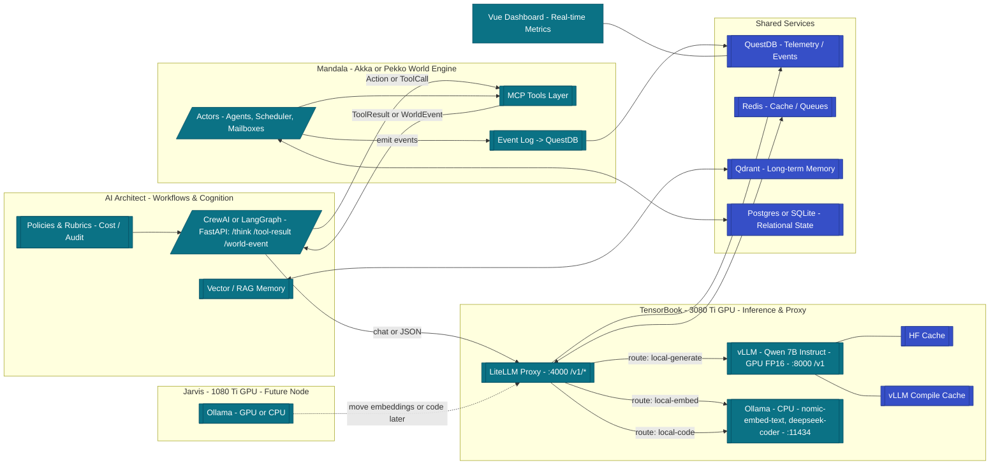
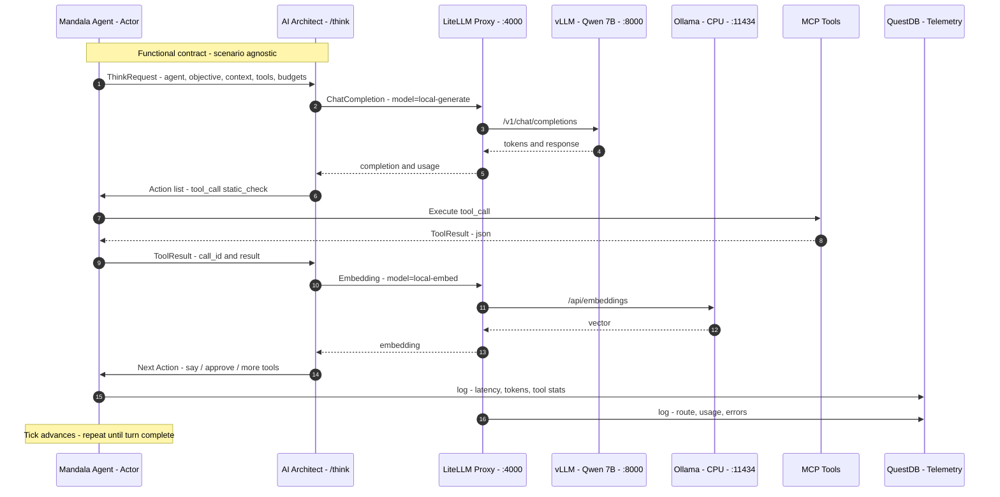

# 🧭 AI Architect + Mandala Roadmap

**Last Updated:** 2025-10-20  
**Author:** Rodrigo Oliveira  

---

## 🎯 Project Overview

This roadmap defines the phased development plan for integrating **AI Architect** with **Mandala** — a modular actor-based world engine — to create a platform for multi-agent simulations across domains like:

- 👩‍💻 **Dev Team Collaboration** (Agile workflow)
- 🕺 **Night-Out Social Behavior**
- 💹 **Hedge Fund Decision-Making**

The long-term vision is a unified framework where:

- **AI Architect** owns the *workflows, cognition, and LLM orchestration*.
- **Mandala** owns the *world state, time, event persistence, and tool execution*.
- Communication happens through a **functional message contract**, not scenario-specific APIs.

---

## 🧩 Architectural Principle

| Layer | Responsibility | Key Tech |
|-------|----------------|----------|
| **AI Architect** | Cognition, workflows, cost & audit, memory, RAG | FastAPI, CrewAI or LangGraph, LiteLLM gateway |
| **Mandala** | Time, actor supervision, persistence, tools | Akka/Pekko, QuestDB, Redis, Qdrant |
| **LLM Infrastructure** | Local inference + routing | vLLM / TGI, LiteLLM, Ollama |
| **Dashboard** | Real-time telemetry | Vue + QuestDB |
| **Data Services (Finance)** | Offline/online features | Feast for Finance, Redis, Parquet |

---

## 🧱 Functional Message Contract

All workflows communicate via a scenario-agnostic JSON schema.

### Message Types
- **ThinkRequest** – Mandala → AI Architect: “decide what to do next.”
- **Action** – AI Architect → Mandala: tool calls, messages, or world interactions.
- **ToolResult** – Mandala → AI Architect: results of executed tools.
- **WorldEvent** – Mandala → AI Architect: external events, broadcasts.
- **MemoryOp** – Either direction: read/write long-term memory.

This neutral contract keeps Architect scenario-agnostic and allows independent evolution of workflows and world logic.

---

## 🚀 Phased Development Plan

### **Phase 1 — Local LLM Infrastructure Setup**
**Goal:** Establish reliable, low-cost inference and routing.

**Deliverables**
- `vLLM` or `TGI` running **Llama-3 8B** or **Qwen 2.5 7B/14B** on the 3080 Ti.
- `LiteLLM` gateway routes: `/generate`, `/embed`, `/judge`.
- `Ollama` or `llama.cpp` for local tests.
- Shared **Redis + QuestDB** for cache and metrics.
- Basic FastAPI test endpoint (`/hello_llm`).

**Outcome:** Baseline latency, throughput, and cost.  
_No business logic yet — just plumbing._

---

### **Phase 2 — Proof of Concept (Dev-Team Scenario)**
**Goal:** Validate the integration between AI Architect (brains) and Mandala (world).

**Deliverables**
- Workflow pack inside AI Architect (CrewAI/LangGraph)  
  Roles: *Dev, QA, Reviewer, Scrum Master*  
  Graph: `receive_ticket → plan → code → test → review → report`
- Mandala prototype with simulated repo tools (`edit_file`, `run_tests`, `review_pr`).
- Implement message contract (`ThinkRequest`, `Action`, `ToolResult`, etc.).
- Vue dashboard + QuestDB telemetry.

**Outcome:**  
✅ Validated end-to-end loop (LLM → Action → Tool → Result → Next Step).  
✅ Real telemetry for analysis.

**Decision:**  
If the integration is stable, promote this to **MVP** quality instead of rewriting later.

---

### **Phase 3 — MVP (Minimum Viable Platform)**
**Goal:** Harden architecture, modularize, and prepare for new scenarios.

**Deliverables**
- Split repositories:
  - `mandala-core` — actors, tools, event log.
  - `ai-architect` — workflow packs, cognition service.
- Docker-Compose or Helm deployment including:  
  `vllm`, `LiteLLM`, `Architect`, `Mandala`, `QuestDB`, `Qdrant`, `Redis`.
- Add persistence (event sourcing) + replay.
- Formalize functional message contract (versioned).
- Unit tests mocking ToolResults to run workflows without Mandala.
- Grafana dashboards for cost/latency/tool metrics.

**Outcome:**  
Reusable, production-ready skeleton where new workflows plug in cleanly.

---

### **Phase 4 — Multi-Scenario Expansion**
**Goal:** Onboard a new development team to extend platform to additional domains.

**Deliverables**
- “Workflow Pack Template” inside AI Architect.
- Documentation for message contracts and tool registration.
- Scenarios:
  1. **Night Out** — social agents, venues, proximity rules.  
  2. **Hedge Fund** — integrates **Feast for Finance**; roles: PM, Research, Trader, Risk, Compliance.
- CI/CD pipelines, deterministic replay, and regression suite.

**Outcome:**  
Platform demonstrates domain-agnostic extensibility and team scalability.

---

## ⚖️ Value of Mandala Integration

| Feature | Architect-Only | Architect + Mandala |
|----------|----------------|--------------------|
| Deterministic time & replay | Limited | ✅ Full event sourcing |
| Concurrency control | Async I/O | ✅ Actor backpressure |
| Fault tolerance | App-level | ✅ Supervision trees |
| Simulation realism | Mocked | ✅ Realistic tool physics |
| Scaling agents | Moderate | ✅ High |
| Setup complexity | Low | Higher (one more service) |

**Rule of Thumb**
- *Exploration & prototype* → Architect-only.  
- *Production-like simulations* → Architect + Mandala.

---

## 🗓️ Suggested Timeline (approx.)

| Phase | Duration | Key Outcome |
|-------|-----------|-------------|
| 1 | 2 weeks | Local inference infra live |
| 2 | 3 weeks | Dev-team workflow validated |
| 3 | 4 weeks | MVP platform with replay & dashboards |
| 4 | ongoing | New scenarios by extended dev team |

---

## 🔩 Next Steps

1. Finalize the **functional message contract** schema.  
2. Implement `/think`, `/tool-result`, and `/world-event` endpoints.  
3. Stand up Phase 1 infra (vLLM + LiteLLM + QuestDB).  
4. Build Dev-Team workflow pack and validate the loop.  
5. Transition to MVP without discarding code.  
6. Prepare documentation for new teams to add scenarios.

---

## 💬 Notes

- **AI Architect** can run standalone (mocked tools) for demos.  
- **Mandala** becomes essential for time-based, replayable, multi-agent simulations.  
- The roadmap keeps both paths compatible via the **functional contract**.

---

*End of Roadmap*

