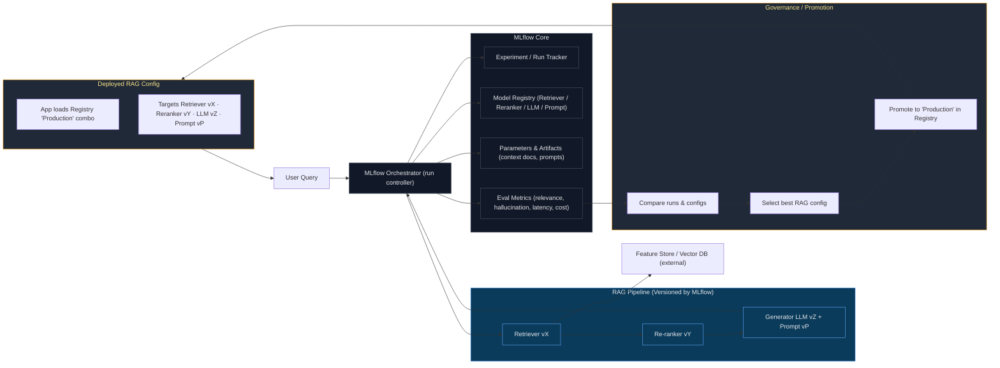
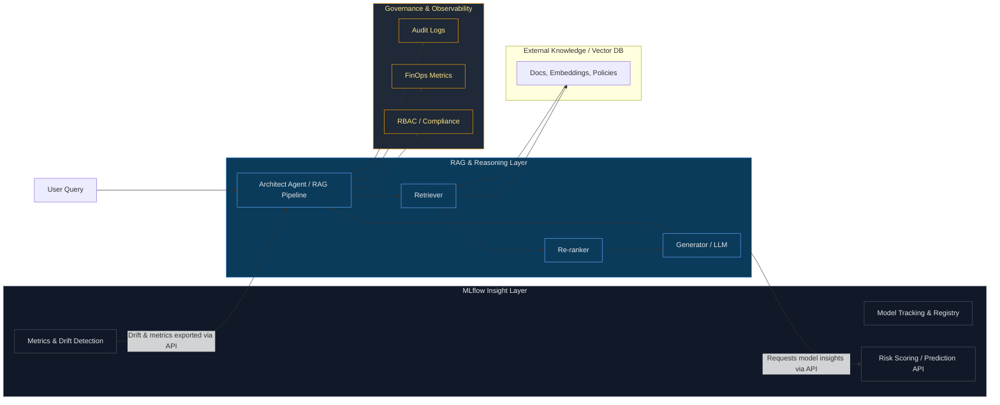

## Hypothetical design where MLflow orchestrates a RAG pipeline

```mermaid
flowchart LR
  U["User Query"] --> O["MLflow Orchestrator (run controller)"]

  subgraph MLflow_Core["MLflow Core"]
    T["Experiment / Run Tracker"]
    MR["Model Registry (Retriever / Reranker / LLM / Prompt)"]
    P["Parameters & Artifacts (context docs, prompts)"]
    E["Eval Metrics (relevance, hallucination, latency, cost)"]
  end

  subgraph RAG_Pipeline["RAG Pipeline (Versioned by MLflow)"]
    R["Retriever vX"]
    RR["Re‑ranker vY"]
    G["Generator LLM vZ + Prompt vP"]
  end

  O --> T
  O --> MR
  O --> P

  %% Orchestrated flow
  O --> R
  R --> RR
  RR --> G
  G --> O

  %% Evaluation & governance
  O --> E

  subgraph Decisions["Governance / Promotion"]
    D1["Compare runs & configs"]
    D2["Select best RAG config"]
    D3["Promote to 'Production' in Registry"]
  end

  E --> D1 --> D2 --> D3

  subgraph Serving["Deployed RAG Config"]
    S1["App loads Registry 'Production' combo"]
    S2["Targets Retriever vX · Reranker vY · LLM vZ · Prompt vP"]
  end

  D3 --> Serving
  Serving --> U

  %% Optional external stores
  FS["Feature Store / Vector DB (external)"]
  R --> FS

  classDef mlflow fill:#111827,stroke:#4B5563,color:#E5E7EB
  classDef rag fill:#0B3B5A,stroke:#60A5FA,color:#E5E7EB
  classDef gov fill:#1F2937,stroke:#F59E0B,color:#FDE68A
  class MLflow_Core,O,T,MR,P,E mlflow
  class RAG_Pipeline,R,RR,G rag
  class Decisions,Serving gov
```

## Actual architecture: MLflow provides insights to RAG via APIs, not orchestration

```mermaid
flowchart LR

  U["User Query"] --> A["Architect Agent / RAG Pipeline"]

  subgraph RAG_System["RAG & Reasoning Layer"]
    R["Retriever"]
    RR["Re-ranker"]
    G["Generator / LLM"]
    A --> R --> RR --> G --> A
  end

  subgraph MLflow_System["MLflow Insight Layer"]
    M1["Model Tracking & Registry"]
    M2["Metrics & Drift Detection"]
    M3["Risk Scoring / Prediction API"]
  end

  subgraph Data_Sources["External Knowledge / Vector DB"]
    V["Docs, Embeddings, Policies"]
  end

  %% Integration points
  G -->|"Requests model insights via API"| M3
  M2 -->|"Drift & metrics exported via API"| A
  R --> V
  V --> R

  subgraph Observability["Governance & Observability"]
    O1["Audit Logs"]
    O2["FinOps Metrics"]
    O3["RBAC / Compliance"]
  end

  A --> O1 & O2 & O3

  classDef rag fill:#0B3B5A,stroke:#60A5FA,color:#E5E7EB
  classDef mlflow fill:#111827,stroke:#4B5563,color:#E5E7EB
  classDef obs fill:#1F2937,stroke:#F59E0B,color:#FDE68A
  class RAG_System,A,R,RR,G rag
  class MLflow_System,M1,M2,M3 mlflow
  class Observability,O1,O2,O3 obs
```
